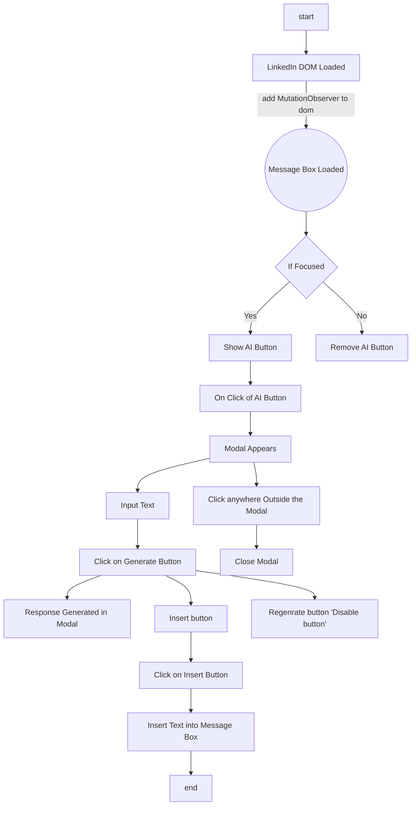

# LinkedIn AI Reply Chrome Extension

## Languages
React JS ✅ | TypeScript ✅ | Tailwind CSS ✅

## Required Tasks - Done
1. Show the AI icon when the user focuses on the LinkedIn message input field _(refer Figma Screen 1)_. ✅
2. The icon should disappear when the input field is no longer focused. ✅
3. Display a center-aligned modal when clicking on the icon. ✅
4. Clicking anywhere outside this modal should close it. ✅
5. The user can enter any command in the modal's input field. ✅
6. Clicking on the “Generate” button should just display this dummy response: `Thank you for the opportunity! If you have any more questions or if there's anything else I can help you with, feel free to ask.` ✅
    1. The “Regenerate” button should be non-functional. ✅
7. When the user clicks on the insert button, the generated static text should be inserted properly into the message input field. ✅

## Constraints

-    Must use [**WXT Framework**](https://wxt.dev/) for building the extension. ✅
-   Must use `React` with `TypeScript`. ✅
-   Must use `Tailwind CSS` for styling. ✅
-   Avoid using any other third-party libraries for UI or icons. ✅
-   Don't do anything extra that is not part of the required task. Instead, if you have some time left, focus on handling any edge cases and improving code quality. ✅


##  This is a 30-sec video demonstrating  the extension.
https://github.com/user-attachments/assets/9ff01e29-a0f6-49ad-8c59-492d19c21b3b


## Flowchart Explanation

The following flowchart illustrates the sequence of interactions within the extension:



## I was confused :)

I was confused about when the user clicks the insert button. It should insert the text (response) into the div with or without the active send button. In Figma Screen 5, the text (response) was inserted without the button being active, so I implemented both. By default, it is set to the state without the active button (Figma Screen 5). However, one can uncomment the relevant code to insert with the active button.

Here are the images for reference:  
![Figma Screen 5 | Extension's Default Behaviour]


##### This is the default behaviour
```javascript
// This is default behaviour this inserts the text without being the send button active.
if (msgFormContenteditable) {
    const msgFormPlaceholder = document.querySelector(".msg-form__placeholder") as HTMLDivElement;
    const paragraph = msgFormContenteditable.querySelector("p") as HTMLParagraphElement;
    if (msgFormPlaceholder) msgFormPlaceholder.remove();
    if (paragraph) paragraph.textContent = staticResponse;
    setShowModal(false);
}
```

##### Uncomment this code to activate the button
```javascript
// Uncomment this block of code to Insert the text with send button active.
if (msgFormContenteditable) {
    msgFormContenteditable.focus();
    document.execCommand("insertText", false, staticResponse);
    setShowModal(false);
}
```

## Installation

1. Clone the repository:
   ```bash
   git clone https://github.com/vishal-y/Vishal_LinkedIn_AI_reply
   ```
2. Install dependencies:
   ```bash
   npm install
   ```
3. Run on localhost:
   ```bash
   npm start
   ```

## END -- Thank you :)
